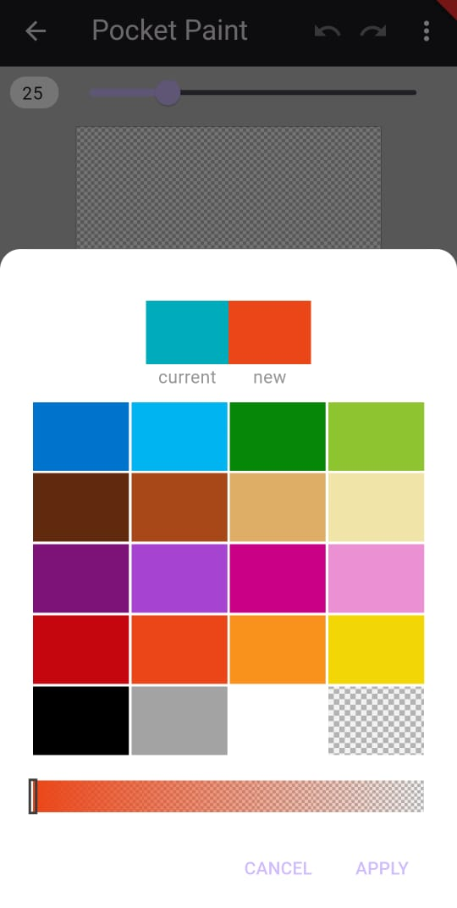

# Google Summer of Code 2024

## Project Overview 
The aim of my GSoC project was to implement the following:
- A comprehensive color picker including the pipette tool
- Implement drawing tools: text, spray and watercolor
- Address other pending features: hide buttons, share functionality and introduce guided tour, app theme customization for improved user experience

## Tasks Accomplished

### 1. Color Picker 
A comprehensive color picker to change the color of tools; the functionality to choose from a set of defined colors and adjust the alpha value. On the top left there is the color which was chosen before opening the dialog and the current color chosen with the dialog.

- Related issue: [Paintroid-455](https://catrobat.atlassian.net/browse/PAINTROID-455)
- Pull Request: [Paintroid#40](https://github.com/Catrobat/Paintroid-Flutter/pull/40)

### 2. Pipette Tool
A pipette tool for selecting a particular color from the current state of the drawing canvas, this tool is a part of the colorpicker package itself and allows the user to pick any color from the drawing and use it on other objects.

- Related issue: [Paintroid-737](https://catrobat.atlassian.net/browse/PAINTROID-737)
- Pull Request: [Paintroid#78](https://github.com/Catrobat/Paintroid-Flutter/pull/78)

### 3. Text Tool
A text tool to add text to drawings so as to label or describe particular objects in it. This text tool is designed to be in consistent with the UI and functionality of the one in the original pocket paint application.

- Related issue: [Paintroid-759](https://catrobat.atlassian.net/browse/PAINTROID-759)
- Pull Request: [Paintroid#86](https://github.com/Catrobat/Paintroid-Flutter/pull/86)

### 4. Spray Can Tool
A spray can tool to apply spray paint effect to the drawings to create textures or shaded areas that mimic the look of real spray paint. This spray can tool is designed to be in consistent with the UI and functionality of the one in the original Pocket Paint application, allowing users to control the spray intensity and spread for customized effects.

- Related issue: [Paintroid-768](https://catrobat.atlassian.net/browse/PAINTROID-768)
- Pull Request: [Paintroid#95](https://github.com/Catrobat/Paintroid-Flutter/pull/95)

## Other Related Issues and Pull Requests

- [Paintroid-717](https://catrobat.atlassian.net/browse/PAINTROID-717)
- [Paintroid-719](https://catrobat.atlassian.net/browse/PAINTROID-719)
- [Paintroid-722](https://catrobat.atlassian.net/browse/PAINTROID-722)
- [Paintroid#64](https://github.com/Catrobat/Paintroid-Flutter/pull/64)
- [Paintroid#56](https://github.com/Catrobat/Paintroid-Flutter/pull/56)

